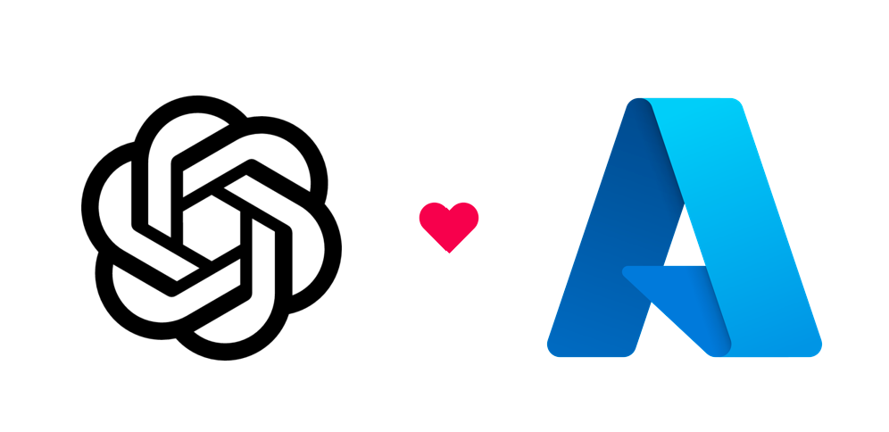

<div align="center">

# OpenAI Java SDK


[](https://github.com/devlive-community/openai-java-sdk)


<h3> 为 Java 开发人员提供方便易用的 SDK 来与开放 AI 模型的 API 进行交互。</h3>

</div>

# 支持平台

---

<div align="center">
    <a href="https://azure.microsoft.com/en-us/products/ai-services/openai-service" target="_blank">
        
    </a>&nbsp;
    <a href="https://openai.com" target="_blank">
        
    </a>&nbsp;
    <a href="https://claude.ai/" target="_blank">
        
    </a>&nbsp;
</div>

# 如何使用?

---

```java
<properties>
    <openai.version>LATEST</openai.version>
</properties>

<dependencies>
    <dependency>
        <groupId>org.devlive.sdk</groupId>
        <artifactId>openai-java-sdk</artifactId>
        <version>${openai.version}</version>
    </dependency>
</dependencies>
```

`LATEST` 默认情况下将使用最新版本。

# Feature

---

- 基于平台快速开发产品，提高开发效率，满足快速交付需求。
- 简洁易懂，代码规范要求，可作为企业代码规范。
- 使用步骤非常简单，一行代码实现所需功能。
- 支持多种代理平台，完美适配各种 API。
- 根据模型动态扩展 Max Tokens
- 丰富的前期数据验证，避免直接接触 API

## Star History

---

[](https://star-history.com/#devlive-community/openai-java-sdk&Date)

## Contributor

---

<a href="https://github.com/devlive-community/openai-java-sdk/graphs/contributors">
  
</a>
